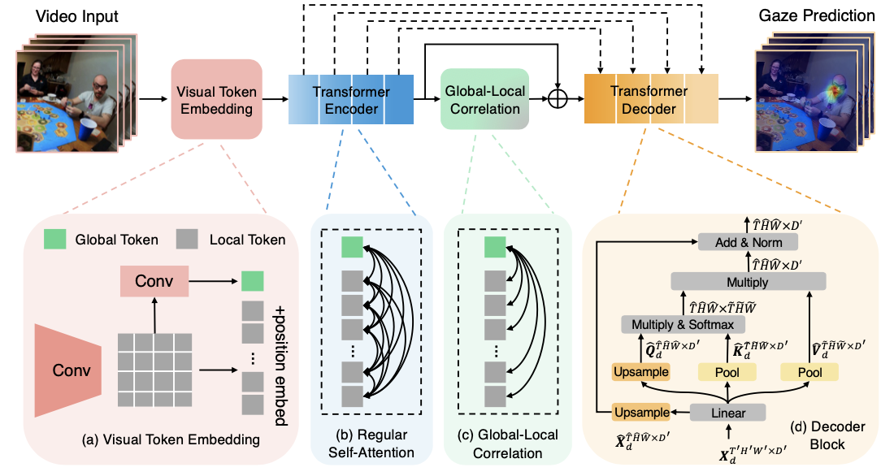

# Global-Local Correlation for Egocentric Gaze Estimation

This is the official codes for the paper "In the Eye of Transformer: Global-Local Correlation for Egocentric Gaze Estimation". ([Project Page](https://bolinlai.github.io/GLC-EgoGazeEst/) | [BMVC Paper](https://bmvc2022.mpi-inf.mpg.de/0227.pdf) | [IJCV Paper](https://link.springer.com/article/10.1007/s11263-023-01879-7))

**[Update]** Please check out our latest work about egocentric gaze forecasting -- ["Listen to Look into the Future: Audio-Visual Egocentric Gaze Anticipation"](https://bolinlai.github.io/CSTS-EgoGazeAnticipation/).

**[Update]** This work was accepted by International Journal of Computer Vision (IJCV).

**[Update]** We won the Best Student Paper award of BMVC.


## Introduction



## Installation

Please find installation instructions in [INSTALL.md](INSTALL.md). This repository is built based on [SlowFast](https://github.com/facebookresearch/SlowFast), so you can also refer to the instructions in [SlowFast Installation](https://github.com/facebookresearch/SlowFast/blob/main/INSTALL.md).
You may follow the instructions in [DATASET.md](slowfast/datasets/DATASET.md) to prepare the datasets. Pretrained models on Kinetics can be downloaded [here](https://github.com/facebookresearch/SlowFast/blob/main/MODEL_ZOO.md) (The pretrained checkpoint is somehow unavailable. We also uploaded the pretrained MViT [weights](https://drive.google.com/file/d/1cZjY9jK7urPxvZfYumIVVVvdXLmVsiJk/view?usp=drive_link) online).

## Quick Start

Follow the example in [GETTING_STARTED.md](GETTING_STARTED.md) to start training your own model.

## Pretrained Weights
We have released our pretrained GLC model with best performance on EGTEA and Ego4D. You can download via these links [[EGTEA weights](https://drive.google.com/file/d/15XVipU1CqoosyvPU1vfcG0w2LuLQecF1/view?usp=sharing) | [Ego4D weights](https://drive.google.com/file/d/1zQdZuV4OowEJxBZAAWr_MuZcN7LJujOw/view?usp=sharing)].


## Citation
If you find our work useful in your research, please use the following BibTeX entry for citation.
```BibTeX
@article{lai2022eye,
  title={In the Eye of Transformer: Global-Local Correlation for Egocentric Gaze Estimation},
  author={Lai, Bolin and Liu, Miao and Ryan, Fiona and Rehg, James},
  journal={British Machine Vision Conference},
  year={2022}
}
```
```BibTeX
@article{lai2023eye,
        title={In the eye of transformer: Global--local correlation for egocentric gaze estimation and beyond},
        author={Lai, Bolin and Liu, Miao and Ryan, Fiona and Rehg, James M},
        journal={International Journal of Computer Vision},
        pages={1--18},
        year={2023},
        publisher={Springer}
      }
```
